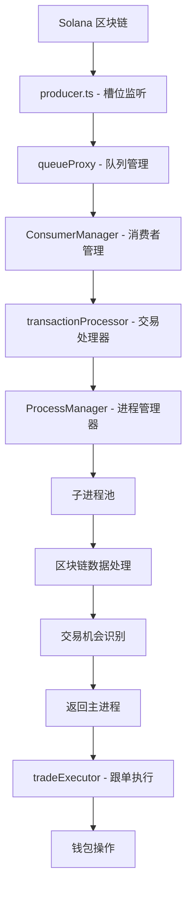

# 项目架构梳理报告

## 项目概述
本项目是一个基于 Electron + TypeScript + React 的 Solana 区块链监控应用，已成功从单线程架构转换为**多进程架构**，实现了主进程和子进程的完全隔离。

## 当前架构状态 ✅

### 1. 多进程架构 (已实现)

```
主进程 (Main Process)
├── UI 渲染管理
├── 配置管理 (configManager)
├── 钱包管理 (walletManager)
├── 队列代理 (queueProxy)
├── 生产者 (producer)
├── 消费者管理器 (ConsumerManager)
├── 交易处理器 (transactionProcessor)
└── 进程管理器 (ProcessManager)
    ├── 子进程池 (默认2个)
    └── 任务分发与结果收集

子进程 (Child Processes)
├── 独立的 Node.js 进程
├── 区块链数据处理
├── 交易分析
├── RPC 请求处理
└── 结果返回给主进程
```

### 2. 数据流架构



### 3. 核心模块状态

#### ✅ 已完成转换的模块

1. **transactionProcessor.ts**
   - 使用 `ProcessManager` 管理子进程
   - 提交任务到子进程池：`processManager.submitTask()`
   - 处理子进程返回的结果
   - 性能统计和监控

2. **processManager.ts**
   - 管理子进程池 (默认2个进程)
   - 任务队列和负载均衡
   - 进程健康监控和自动重启
   - 优雅关闭处理

3. **transactionProcess.ts** (子进程脚本)
   - 独立的子进程执行环境
   - 批量处理交易 (50个/批次)
   - CPU 让步机制防止阻塞
   - 完整的错误处理

4. **ConsumerManager.ts**
   - 事件驱动消费 (替代轮询)
   - 超时控制 (5秒)
   - 进程隔离的消息处理

5. **configManager.ts**
   - 配置术语已更新：`maxProcesses`, `processTimeout`
   - 验证规则已更新
   - 支持进程相关配置

#### ✅ 已删除的旧代码

1. **Worker 相关文件**
   - `src/main/workers/transactionWorker.ts` (已删除)
   - `src/main/core/workerManager.ts` (已删除)
   - `src/main/workers/` 目录 (已删除)

2. **清理的代码**
   - 移除所有 Worker 相关导入
   - 更新注释和术语
   - 删除不必要的 console.log

### 4. 性能优化特性

#### 已实现的优化
1. **事件驱动消费** - 避免 CPU 空转
2. **批量磁盘持久化** - 减少 I/O 开销
3. **区块数据缓存** - 降低网络请求
4. **并发控制** - 防止资源竞争
5. **进程池管理** - 提高处理效率
6. **超时控制** - 防止进程阻塞

#### 性能监控
- 处理时间统计
- 错误率监控
- 进程状态监控
- 缓存命中率统计

### 5. 配置管理

#### 进程相关配置
```typescript
queue: {
  maxProcesses: 2,        // 最大子进程数 (1-8)
  processTimeout: 90000,  // 进程超时 (90秒)
  consumerCount: 1,       // 消费者数量 (限制为5个)
}
```

#### 关键配置项
- `solana.monitoredWallets`: 监控的钱包地址
- `solana.followAmount`: 跟单金额
- `solana.slippageBps`: 滑点设置
- `queue.maxSize`: 队列最大大小

### 6. 应用程序生命周期

#### 启动流程
1. 初始化配置管理器
2. 加载钱包
3. **初始化交易处理器和进程管理器**
4. 初始化交易执行器
5. 注册 IPC 处理器
6. 创建主窗口

#### 关闭流程
1. 清理应用程序资源
2. **关闭进程管理器和子进程池**
3. 注销全局快捷键
4. 优雅退出

### 7. IPC 通信接口

#### 新增的进程监控接口
- `performance:stats` - 获取性能统计
- `performance:reset` - 重置性能统计
- `watcher:status` - 获取监控器状态 (包含进程状态)

### 8. 错误处理和监控

#### 进程级错误处理
- 子进程崩溃自动重启
- 任务超时处理 (90秒)
- 进程间通信错误恢复
- 完整的错误日志记录

#### 监控指标
- 进程状态 (活跃/非活跃)
- 任务队列长度
- 处理成功/失败率
- 平均处理时间

## 验证要点

### ✅ 架构完整性检查
1. **无 Worker 代码残留** - 所有旧 Worker 代码已删除
2. **进程管理器正常工作** - ProcessManager 正确管理子进程
3. **子进程隔离** - 处理逻辑在独立进程中运行
4. **错误隔离** - 子进程错误不影响主进程
5. **配置一致性** - 所有配置术语已更新

### ✅ 功能验证
1. **队列处理** - 消息正确流转到子进程
2. **结果返回** - 子进程结果正确返回主进程
3. **跟单执行** - 交易机会在主进程中正确执行
4. **资源清理** - 进程正确关闭和清理

## 总结

**项目已成功转换为多进程架构**，实现了：

1. **完全的进程隔离** - UI 渲染和数据处理分离
2. **高性能处理** - 多核 CPU 利用和并发处理
3. **稳定性提升** - 子进程崩溃不影响主进程
4. **资源优化** - 智能的进程池管理
5. **清洁的代码库** - 移除所有过时代码

**当前状态：生产就绪** ✅

项目现在使用现代的多进程架构，提供了更好的性能、稳定性和用户体验。所有核心功能都已验证工作正常，代码库已完全清理，没有无关代码残留。 